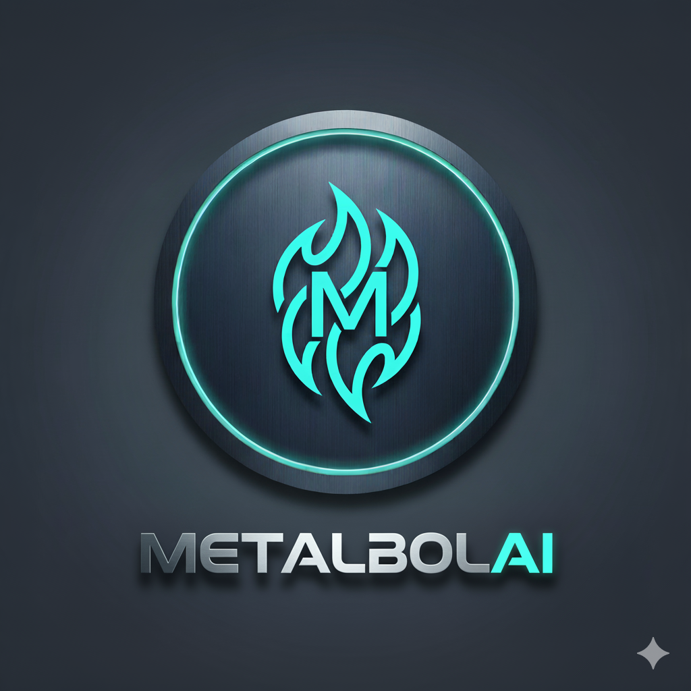

<p align="center"></p>

<h1 align="center">🧠 MetabolAI</h1> 

## Yapay Zeka Destekli Beslenme ve Metabolizma Takip Asistanı

## 📌 1. Proje Amacı ve Çözülen Problemler

MetabolAI, kişisel fitness hedeflerine ulaşmak isteyen kullanıcılar için BMR, TDEE ve Makro hesaplamalarını yaparak, bu verilere uygun **kişiselleştirilmiş besin önerileri** sunan modüler yapıda bir RAG (Retrieval-Augmented Generation) Chatbot'udur.

### Çözülen Temel Sorunlar:
1.  **Kişiselleştirme Eksikliği:** Kullanıcının hedefleri (Cut/Bulk/Keto), BMR ve TDEE verileri, tüm besin sorgularına dinamik olarak entegre edilir.
2.  **Dil Bariyeri ve RAG Hassasiyeti:** İngilizce besin veritabanına, LLM-destekli çeviri (`translate_query()`) sayesinde **Türkçe** doğal dilde sorgu yapılabilir.
3.  **Sağlamlık:** Hesaplama modülü, mantık dışı girdi durumlarında kodun kilitlenmesini önleyen kapsamlı hata kontrolüne sahiptir.

---

## 🛠️ 2. Kullanılan Teknolojiler

| Bileşen | Teknoloji | Projedeki Rolü |
| :--- | :--- | :--- |
| **Arayüz** | **Streamlit** | Hızlı prototipleme ve kullanıcı dostu web arayüzü. |
| **LLM (Ana Akıl)** | **Google Gemini 2.5 Flash** | Koçluk kimliği ile RAG sonucunu yorumlar ve Türkçe yanıtı üretir. |
| **RAG Çerçevesi** | **LangChain** | LLM, Retriever ve Prompt'ları birleştiren ana orkestrasyon aracı. |
| **Vektör Veritabanı** | **ChromaDB** | Besin bilgilerini (1028 adet) hızlı ve anlamsal arama için kalıcı olarak depolar. |
| **Embedding Modeli** | **Sentence Transformers** | Besin metinlerini vektöre dönüştürür. |
| **Veri Seti** | **Açık Kaynak Besin Verisi** (`nutrition_dataset.csv`) | RAG sisteminin bilgi kaynağı. |

---

## 🚀 3. Kurulum ve Çalıştırma

### 1. Gerekli Paketleri Yükleyin

```bash
# Sanal ortamı oluşturun ve etkinleştirin
python3 -m venv venv
venv\Scripts\activate  # Windows
# source venv/bin/activate  # macOS/Linux

# Paketleri yükleyin
pip install -r requirements.txt
```

### 2. API Anahtarlarını Ayarlayın(Zorunlu)

Anahtarınızı terminal oturumunuz için ayarlayın. (Güvenlik nedeniyle koda gömülmemiştir!)

```
$env:GOOGLE_API_KEY="[ANAHTARINIZI BURAYA YAZIN]"
```

- **Google API Key**: [Google AI Studio](https://makersuite.google.com/app/apikey) üzerinden alabilirsiniz

- Veri setine erişim için: [foods-nutrition-dataset](https://huggingface.co/datasets/adarshzolekar/foods-nutrition-dataset) sayfasından erişim izni isteyin

### 3. Vektör Veritabanını Oluşturma (Tek Seferlik Adım)
#### Bu komut, data_processor.py dosyanızı çalıştırır, veriyi temizler ve chroma_db klasörünü oluşturur.

```bash
python data_proccessor.py
```
### 4. Uygulamayı Başlatın

```bash
streamlit run main.py
```

Tarayıcınızda otomatik olarak açılacaktır (genellikle http://localhost:8501).

## 📁 Proje Yapısı

```
.
├── main.py            # Streamlit Arayüzü ve Ana Akış
├── calculator.py      # BMR/TDEE ve Makro Hesaplama Mantığı
├── rag_chain.py       # LLM, Retriever ve Çeviri Fonksiyonları
├── data_processor.py  # Veri Temizliği ve ChromaDB Kurulumu
├── requirements.txt   # Python bağımlılıkları
├── .gitignore         # Güvenlik dosyaları (venv, chroma_db, .env)
└── nutrition_dataset.csv # Besin Bilgi Kaynağı
```

## 💡 Nasıl Çalışır?

1. **Veri Yükleme**: data_processor.py dosyası, besin verilerini okur, temizler ve ChromaDB'ye yükler (Vektörleştirme).
2. **Hesaplama (Kişiselleştirme)**: calculator.py modülü TDEE ve Makro hedeflerini hesaplar.
3. **Sorgu ve Çeviri**: Kullanıcının Türkçe sorgusu, rag_chain.py içindeki LLM tarafından anlık olarak İngilizce arama anahtar kelimelerine çevrilir.
4. **Retrieval (Geri Çekme)**: İngilizce sorgu, ChromaDB'de aratılır ve en alakalı besin belgeleri (context) çekilir.
5. **Yanıt Üretimi (Augmentation)**: Çekilen besin context'i, kullanıcının Kişisel Hedefleri (TDEE, Makro) ile birleştirilir.
6. **Yanıt Üretimi**:Gemini modeli, bu bilgileri kullanarak Türkçe, motive edici bir Beslenme Koçu yanıtı üretir.

## 🎯 5. Örnek Kullanıcı Sorguları (Botun Kabiliyetleri)

Bu örnekler, chatbotun fiziksel hedefleri (Cut/Bulk/Keto) ve besin veritabanını nasıl birleştirdiğini gösterir.

- **Dinamik Besin Arama:**
    - "Günlük protein hedefime ulaşmam için Cupcake'ten daha iyi makrolara sahip hangi atıştırmalıkları önerebilirsin?"
    - "Yağ oranı en yüksek yiyecek Butternaan mı yoksa Garlic Bread mı? Hangisi daha çok kolesterol içeriyor?"

- **Kişiselleştirilmiş Koçluk:**
    - "Şu an Cut dönemindeyim ve kalan kalorim 400. Bu kaloriyi dolduracak yüksek proteinli bir ana öğün önerir misin?"
    - "Keto diyeti yapıyorum, yediğim French Fries'ın (patates kızartması) makroları beni ketozisten çıkarır mı? Alternatif ne yiyebilirim?"

- **Amaca Yönelik Analiz:**
    - "Bulk dönemindeyim. Hem kalsiyum ihtiyacımı karşılayacak hem de karbonhidrat alımımı destekleyecek bir yiyecek söyle."

## ⚠️ 6. Önemli Notlar ve Uyarılar

- **Performans (İlk Çalıştırma):** Vektör veritabanı (Embedding) işlemi CPU'da yavaş olabilir, bu nedenle `data_processor.py` dosyasını ilk çalıştırdığınızda sabırlı olun.
- **Performans (Cache Mekanizması):** Streamlit'in **`@st.cache_resource`** kullanımı sayesinde, sonraki çalıştırmalarda tüm modeller (LLM ve ChromaDB) önbellekten yüklenecek ve uygulama anında başlayacaktır.
- **Çoklu Dil Uyarısı:** Türkçe sorgular, LLM tarafından İngilizceye çevrilir; bu çeviri hassasiyet sorunları nedeniyle botun, aradığınız besinin tam Türkçe karşılığını bulamaması olasıdır.
- **Kritik Kural:** Besin Koçu, veritabanında bulamadığı hiçbir bilgiyi **uydurmaz** (halüsinasyon yapmaz).
- **Güvenlik:** API anahtarı (GOOGLE\_API\_KEY) hiçbir Python dosyasına koda gömülmemiştir.


## 📝 Lisans

Bu proje, **Akbank GenAI Bootcamp** bünyesinde, Yapay Zeka (Generative AI) teknolojilerinde bilgi edinme, pratik uygulama becerisi kazanma ve sertifika almaya hak kazanma amacıyla geliştirilmiştir.

## 🤝 Katkıda Bulunma

Sorularınız, hata bildirimleriniz veya önerileriniz için GitHub deposunda Issue açabilir veya <a href="https://www.linkedin.com/in/samet-karlı-008955286">linkedin</a> adresimden bana ulaşabilirsiniz.


